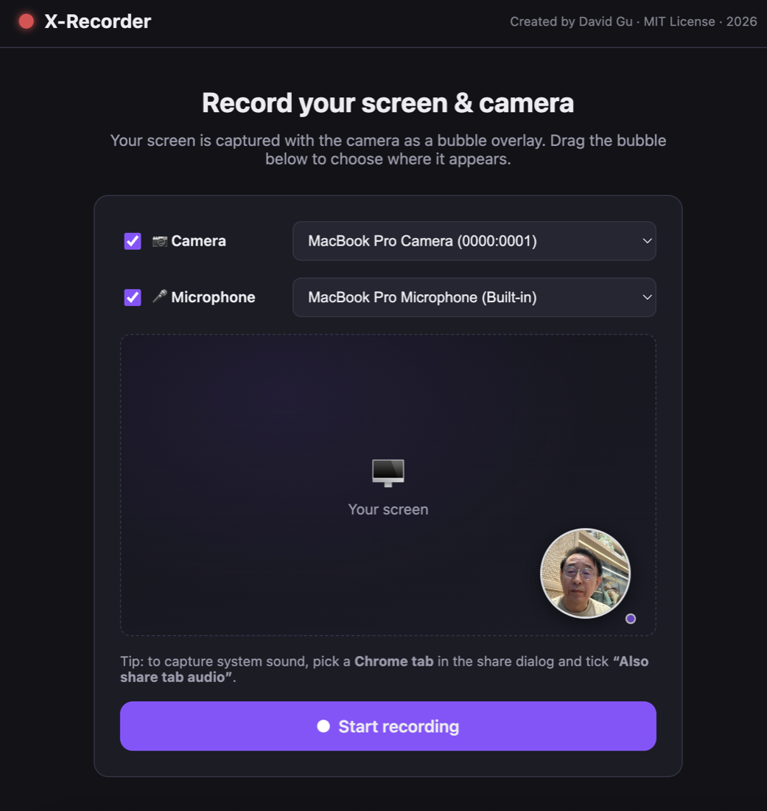

# X-Recorder

A browser-based screen recorder (Clipchamp-style). Vanilla HTML/CSS/JS, no
build step, no dependencies.

**▶ Live: https://david0806sg.github.io/x-recorder/** — open in Chrome and record.

<p align="center">
  
</p>

## Features

- **Screen & Camera recording**: the camera is composited as a
  picture-in-picture bubble, burned into the output. (Falls back to
  screen-only if the camera is unavailable.)
- **Camera bubble**: position and size it on the setup screen's mockup before
  recording, then drag to reposition, resize via the corner handle, toggle
  circle/rectangle, hide/show — all live during recording and reflected in
  the final video (canvas-composited, WYSIWYG).
- **Audio mixing**: microphone + system/tab audio mixed via Web Audio, with
  independent mute toggles mid-recording.
- **Controls**: 3-2-1 countdown, pause/resume, elapsed timer.
- **Output**: in-browser preview, then download as **MP4 (H.264/AAC)** with a
  resolution choice (High 1080p / Medium 720p / Low 480p) and a frame-rate
  choice (Smooth 30 / Standard 24 / Compact 15 fps) to trade quality for file
  size — converted entirely in the browser (takes about as long as the
  recording; the source is never upscaled). The original WebM is also
  available as an instant download.

## Run

```sh
cd recorder
python3 -m http.server 8000
```

Open http://localhost:8000 in Chrome (or Edge). A secure context
(localhost/https) is required for the capture APIs.

## Notes

- To capture **system sound**, choose a **Chrome tab** in the share dialog and
  tick **“Also share tab audio”**. macOS does not expose system audio for
  full-screen/window capture.
- The compositor draw loop is driven by a Web Worker timer, so recording keeps
  running at full frame rate while the app tab is in the background.
- Chrome's native "Stop sharing" bar ends the recording gracefully — you land
  on the preview with the recording intact.

## Built with Claude Fable 5

This entire app — from an empty folder to a shipped, GitHub Pages–hosted site —
was built collaboratively with **Claude Fable 5**, the first model in
Anthropic's Claude 5 family (a Mythos-class tier above Claude Opus), in a single
conversation.

What stood out about the process:

- **Planned before coding** — explored the problem and agreed an approach before
  writing the first module.
- **Tested in a real browser** — drove Chrome to take screenshots, watch the
  console, and re-import the exported video files to confirm they actually
  played, rather than assuming the code was correct.
- **Caught its own bugs** — found and fixed issues I never reported, including a
  Start-button re-entrancy race and an MP4 codec-packaging problem that broke
  QuickTime playback (`avc3` → `avc1`), both surfaced during its own
  verification.
- **Shipped end-to-end** — cleaned the tree, set up git, pushed the repo, and
  enabled GitHub Pages.

The result: ~2,000 lines across 9 dependency-free ES modules, shaped through
about 14 focused requests.

📊 **[Full build walkthrough & my experience (slide deck)](https://david0806sg.github.io/x-recorder/docs/Built%20Screen%20Recorder%20with%20Claude%20Fable%205%20and%20My%20Experience.html)** —
a 12-slide deck covering the brief, architecture, iteration, and engineering
wins. Source: [`docs/Built Screen Recorder with Claude Fable 5 and My Experience.html`](docs/Built%20Screen%20Recorder%20with%20Claude%20Fable%205%20and%20My%20Experience.html)
(press `S` in the deck for Presenter Mode).
